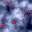
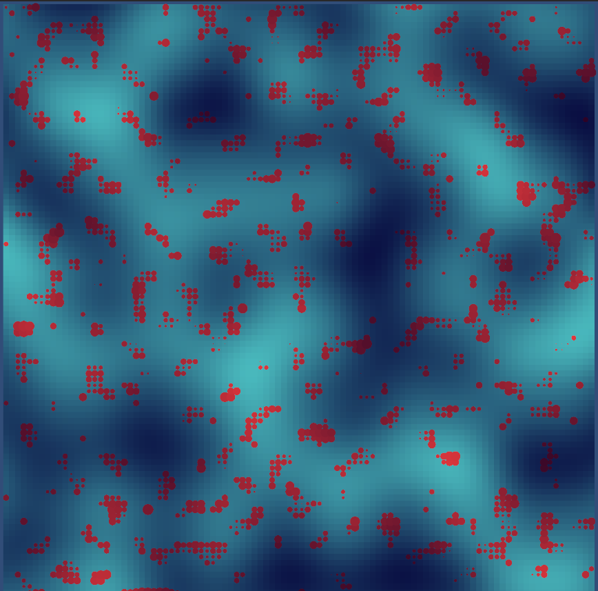

This repository contains two different implementations of procedural 2D tilemap generation, developed for Catrobat's GSoC entry task.
Both tilemaps produce deterministic output via seeds, using perlin noise to generate depth variance and coral features.

## python-generator/

A simple script to produce a tilemap with depth represented by darkness of each pixel, and bright red pixels representing coral placed on tiles of suitable depth using a secondary noise function.
  
Usage:

`pip install -r requirements.txt`

`python generate_map.py`

or with optional arguments

`python generate_map.py --size 32 --seed 42 --terrain-scale 3 --coral-scale 12 --output output.png`

- size: the size of the resulting square image (in pixels)
- seed: the seed used in noise functions for generating the map
- terrain-scale: the scaling of the noise function to produce the map of the ocean floor
- coral-scale: the scaling of the noise function to produce coral
- output: the output filepath

## unity-generator/
I began to design this before the entry task prompt was altered.

This is the Assets folder of a Unity project that follows a similar approach, but with a few more parameters that are modifiable through the Core/Settings scriptable object:

- Ideal height, current, and slope for coral growth
- Weights for each factor in determining the suitability score for coral on any given tile
- Spawn threshold represents the suitability score requirement for coral to be placed

This pattern serves as a stepping stone towards a more advanced AI-based generation system, where the parameters could be tuned in order to emulate real coral-reef structures. 
